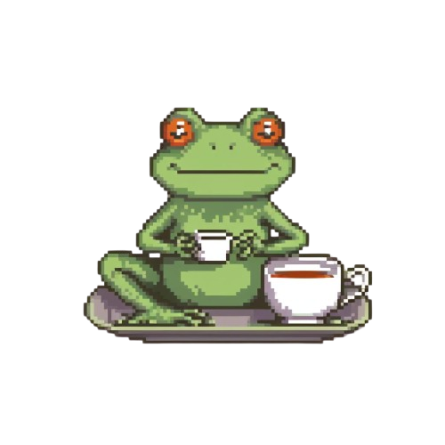
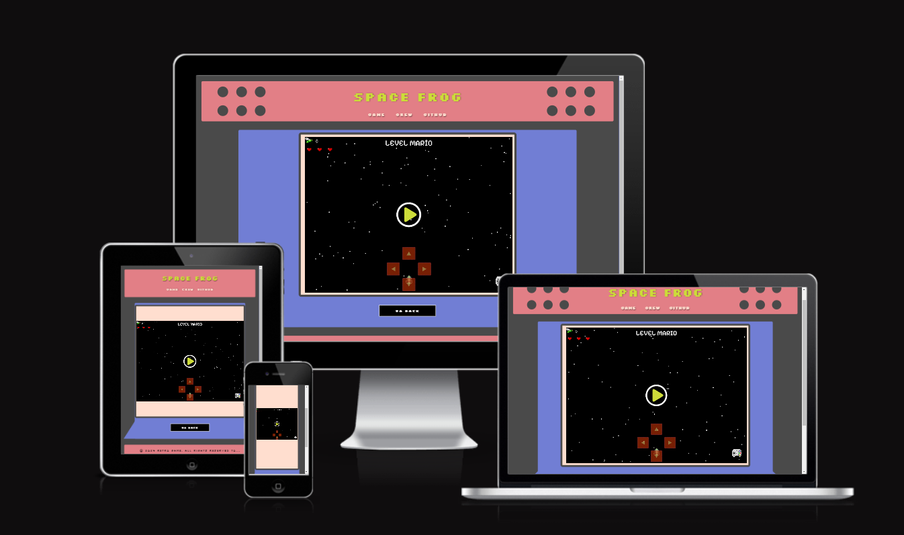
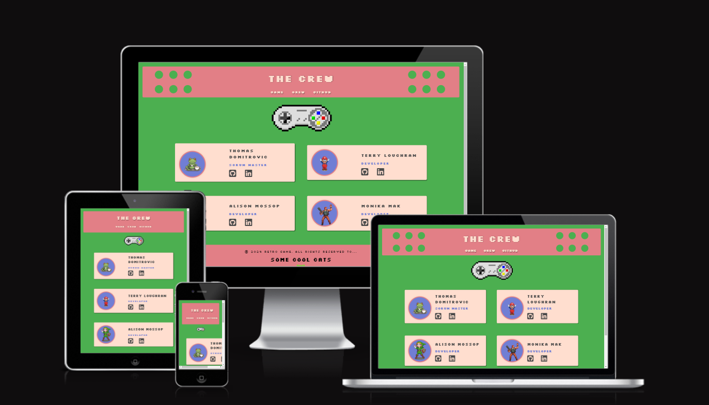
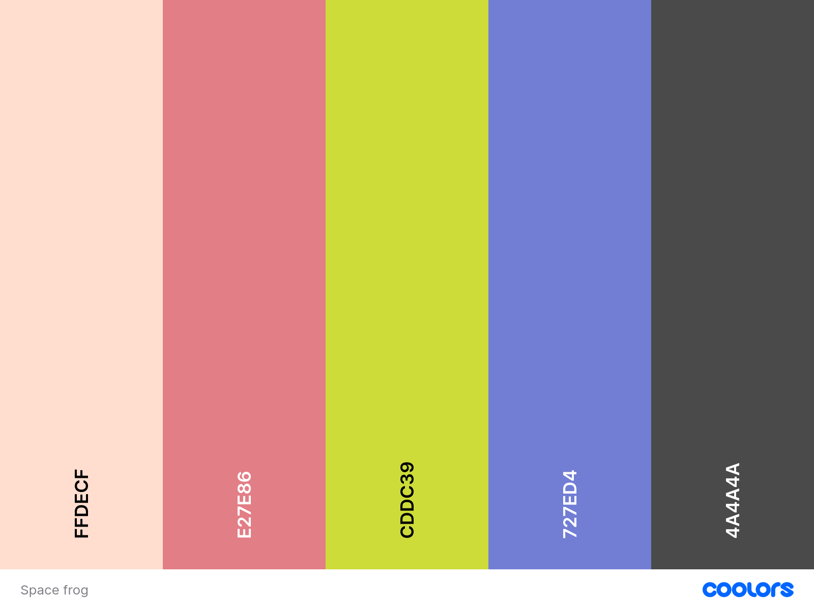
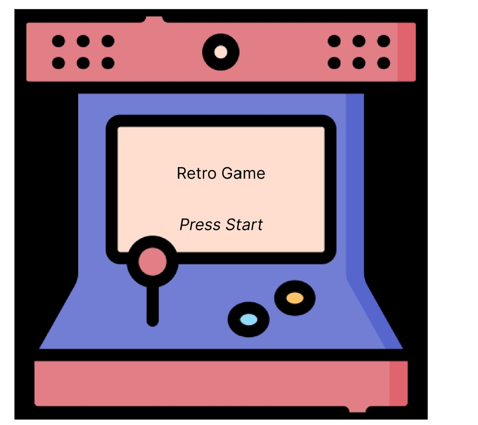
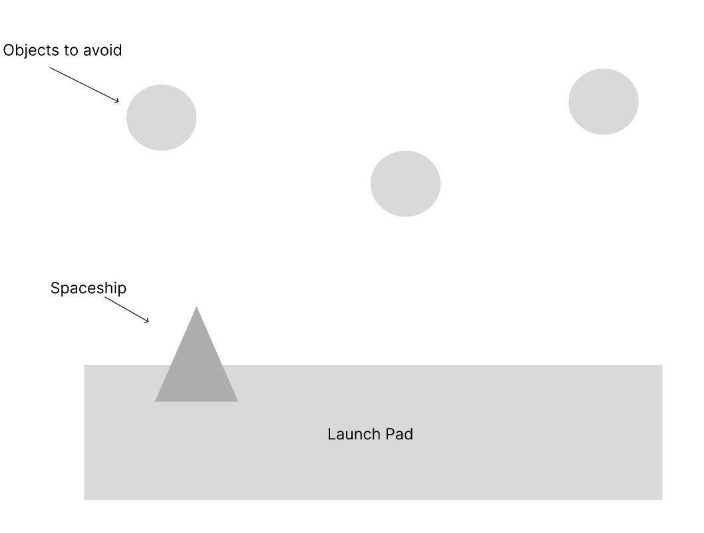
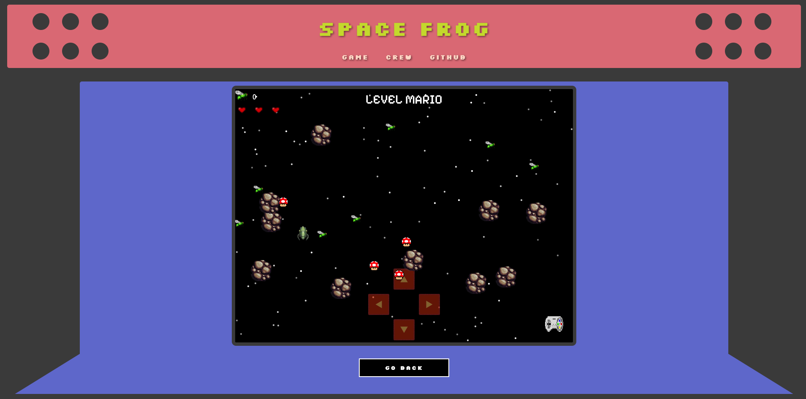

# Welcome to SPACE FROG - THE GAME

This web-based game has a hint of nostalgia with a modern day twist. There are a series of challenging levels that will test any gamer old or new.

We where inspired by the game **Frogger** which is a classic arcade game from the 1980s. We have taken the concept of the game and added our own twist to it. The game is designed to be fun and engaging for all ages. The game is designed to be played on a desktop or laptop computer. The game is not designed for mobile devices (but still works on them).

### Appearance:

## Table of contents

- [Welcome to SPACE FROG - THE GAME](#welcome-to-space-frog---the-game)
    - [Appearance:](#appearance)
  - [Table of contents](#table-of-contents)
    - [Setup Instructions](#setup-instructions)
    - [Forking the GitHub Repository](#forking-the-github-repository)
    - [Colour](#colour)
    - [Wire Frame](#wire-frame)
    - [Testing](#testing)
    - [Functionality Testing:](#functionality-testing)
    - [Edge Case Testing:](#edge-case-testing)
    - [Bug Tracking:](#bug-tracking)
    - [Final Check:](#final-check)
  - [Game Flow](#game-flow)
  - [References](#references)
  - [The Crew](#the-crew)

### Setup Instructions

1. **Log in to Netlify:** Navigate to the [Netlify website](https://www.netlify.com/) and log in to your account.

2. **Create New Site:** Once logged in, click on the "New site from Git" button.

3. **Connect to GitHub:** Choose GitHub as your Git provider and authorize Netlify to access your repositories.

4. **Select Repository:** Select the repository for your website, in this case, "Space Frog."

5. **Configure Settings:** Netlify will automatically detect your build settings, but you may need to adjust them if necessary.

6. **Deploy Site:** Once configured, click on the "Deploy site" button. Netlify will start building and deploying your site automatically.

7. **Live Site:** After the deployment process is complete, Netlify will provide you with a unique URL for your live site. You can access your live site by visiting this URL.

### Forking the GitHub Repository

By forking the repository, we make a copy of the original repository on our GitHub account to view and change without affecting the original repository by using these steps:

1. Log in to Netlify and locate and connect [GitHub Repository Retro Game](https://github.com/Thomas-Tomo/retro_game)
2. At the top of the Repository(under the main navigation) locate "Fork" button.
3. Now you should have a copy of the original repository in your Netlify account.

---

### Colour 

+ Colours were taken from the first image that was used on the wire-frame.
+ Colours were selected using the colors color palette generator.

---
### Wire Frame

Heir is the wireframe that was used to design the game. The wireframe was created using figma. The gave us a clear idea of the look and feel of the over all site.

---

### Testing

Before deploying the game, it's crucial to thoroughly test it to ensure a smooth player experience. Below are the steps for effective testing:

### Functionality Testing:

Verify that all controls (arrow keys, space-bar) work correctly.
Ensure that the frog moves as expected in all directions.
Test collision detection for obstacles, enemies, and pickups.
Confirm that the scoring system and level progression function properly.
Cross-Browser Testing:

Test the game on multiple browsers (Chrome, Firefox, Edge, Safari) to ensure compatibility.
Check for any layout issues or performance discrepancies across different browsers.
Responsive Design:

Verify that the game scales properly on various screen sizes, including desktop, tablet, and mobile devices.
Test touch controls on mobile devices to ensure they work smoothly.
Performance Testing:

Monitor the game’s performance for any lag, frame drops, or crashes, especially during intense action sequences.
Check memory usage and load times to ensure they are within acceptable limits.
User Experience Testing:

Gather feedback from a group of testers regarding the game’s difficulty, controls, and overall enjoyment.
Make adjustments based on player feedback to improve the overall experience.

### Edge Case Testing:

Test unusual scenarios, such as pressing multiple keys at once or reaching extreme scores, to ensure the game handles them gracefully.

### Bug Tracking:

Document any bugs or issues discovered during testing.
Fix identified bugs and retest to confirm that they are resolved. *(The only bugs are the fly's that you can eat 😜)*

### Final Check:

Ensure all features work as intended and that the game provides a fun and challenging experience before the official release.

## Game Flow
1. **Main Screen**
   - The main screen has four buttons:
     - **Game**: Restarts the game.
     - **Crew**: Shows information about the development team.
     - **GitHub**: Shows information about the the Crews Github and Linkedin accounts
     - **Activate Game**: This starts the game.
  
  
    
1. **Button Actions**
   - **Activate Game**:
     - When the player clicks the "Activate Game" button, the game transitions into the first level of the game..
   - **Crew**:
     - When the player clicks the "Crew" button, the user is directed to the team page, with information about the development team. This includes names, and contact information.
     - The player can click on the "Game" button to return to the main screen.
   - **GitHub**:
     - When the payer clicks the "Github" button they are directed to the page, with information about the development team. This includes names, and contact information.
       
2. **Entering the Game**

   - After clicking "Activate Game", the player is taken to the first level.
   - The object of the game is to collect the relavent number of flies to proceed to the next level.
   - There are five levels in total each themed with a different character:-
     - Level 1: Mario
     - Level 2: Sonic
     - Level 3: Contra
     - Level 4: Zelda
     - Level 5: Frogger
   - On each level there are baddies that relates to the the characters level that must be avoided.
  
 3. **Playing the Game**

       The game is available to play on both a PC and mobile device.
    
    *PC version*
      - Use the arrow keys to move up, down, left and right across the screen.
      - Alternatively click the controller on the right hand side of the screen which will then display four arrow keys on the screen which can be used.
   
    *Mobile version*
      - Use the touch screen arrows to up, down, left and right across the screen.
   
    *Both versions*
      - Eat up the flies to continue your journey.
      - Avoid the enemies and boulders.
      - The is an option for the player to pause the game by pressing 'p'
   

5. **End Screen**
  
    - When all the levels have been completed, the player is greeted with some fireworks, an image of a frog and the words "Congratulations"
    - The player has the option to return to the home page.
   

## References

The following links were used:

- [webwizard](https://webwizard.ie/) was used for the design

- [pixabay](https://pixabay.com/sound-effects/search/8-bit/) was used for the sound effects

- [remove](https://www.remove.bg/) was used to remove backgrounds

- [figma](https://figma.com/) was used for the design of wireframes.

- [pngwing](https://www.pngwing.com) was used for the background images.

- [aipixelartgenerator](https://aipixelartgenerator.com/) was used to create the charactors.

- [imagersizer](https://imageresizer.com/) was used to resize the images.

- [layout.bradwoods](https://layout.bradwoods.io/) was used to for the layout.

- [mixkit](https://mixkit.co/) was used for the sound effects.

 - [Video Game Music](https://downloads.khinsider.com/) was used for the sound effects.

### Technologies Used

The Space Frog game is developed using the following tools and technologies:

- **HTML**: For structuring the content and layout of the web pages.
- **CSS**: For styling the website and making it visually appealing.
- **JavaScript**: For implementing the game logic and interactivity.
- **Phaser.js**: For rendering the game across different platforms.

## The Crew

***Thomas Domitrovic***

***Terry Loughran***

***Monika Mak***

***Alison Mossop***

